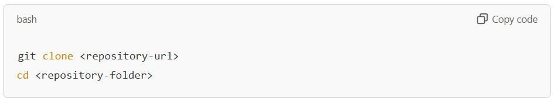
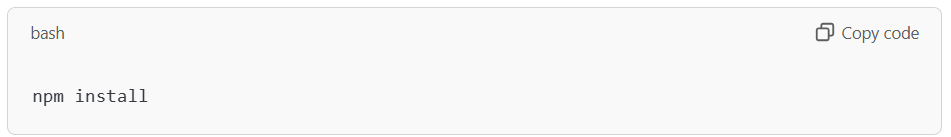
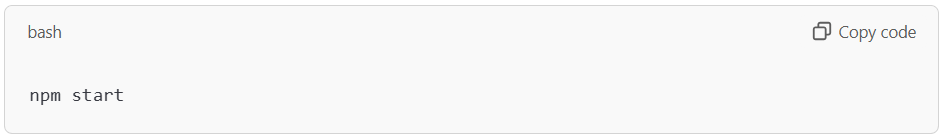
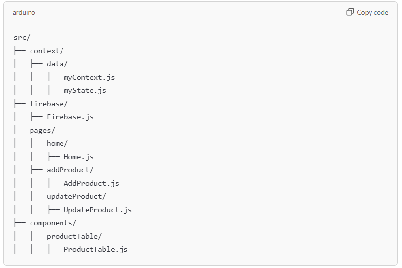

# React + Vite
This template provides a minimal setup to get React working in Vite with HMR and some ESLint rules.

Currently, two official plugins are available:

- [@vitejs/plugin-react](https://github.com/vitejs/vite-plugin-react/blob/main/packages/plugin-react/README.md) uses [Babel](https://babeljs.io/) for Fast Refresh
- [@vitejs/plugin-react-swc](https://github.com/vitejs/vite-plugin-react-swc) uses [SWC](https://swc.rs/) for Fast Refresh

# E-Commerce Dashboard CRUD

A React.js application with Firebase Firestore for managing an e-commerce product dashboard. The application supports CRUD operations for products, including adding, editing, deleting, and searching.

# Features

- Home Page: Displays a table of products with search functionality.
- Add Product: Allows users to add new products.
- Update Product: Enables users to edit existing products.
- Delete Product: Provides the ability to delete a product.
- Search Products: Dynamically filters products based on their title.
- Firebase Integration: Utilizes Firestore for backend data storage and real-time updates.

# Tech Stack

- Frontend: React.js, Tailwind CSS
- Backend: Firebase Firestore
- Routing: React Router DOM

# Setup Instructions

1. Clone the Repository:

2. Install Dependencies:

3. Firebase Configuration:

- Create a Firebase project at [Firebase Console.](https://console.firebase.google.com/)
- Navigate to the Project Settings and get the Firebase configuration object.
- Replace the placeholder values in firebaseConfig inside firebase/Firebase.js with your project's configuration.

4. Run the Application:

5. Open the application in your browser at http://localhost:3000.

# Application Flow

1. Context API:

    - Manages global state for products, including the product list and search input.
    - Handles product-related operations (addProduct, editProduct, deleteProduct).

2. Firebase Firestore:

    - Stores product data with fields like title, price, imageUrl, and category.
    - Updates UI in real-time using Firestore snapshots.

3. Routing:

    - "/": Displays the product table.
    - "/addproduct": Opens the form to add a product.
    - "/updateproduct": Opens the form to edit a product.

4. Components:

    - App.js: Manages routing and wraps the application in a MyState context provider.
    - Home.js: Renders the product table with search and navigation options.
    - AddProduct.js: Contains the form for adding new products.
    - UpdateProduct.js: Contains the form for editing existing products.
    - ProductTable.js: Displays all products in a table format with delete and edit options.

# Directory Structure

# How to Use

1. Add a Product:

    - Navigate to the "Add Product" page.
    - Fill in the product details and click "Add Product".

2. Update a Product:

    - Click the edit button in the product table.
    - Modify the product details and save the changes.

3. Delete a Product:

    - Click the delete button corresponding to the product.

4. Search for a Product:

    - Use the search bar to filter products dynamically by title.

# Future Enhancements

- Implement user authentication for secure access.
- Add categories and sorting options for better organization.
- Optimize performance with memoization and code-splitting.
- Enhance UI with animations and additional themes.